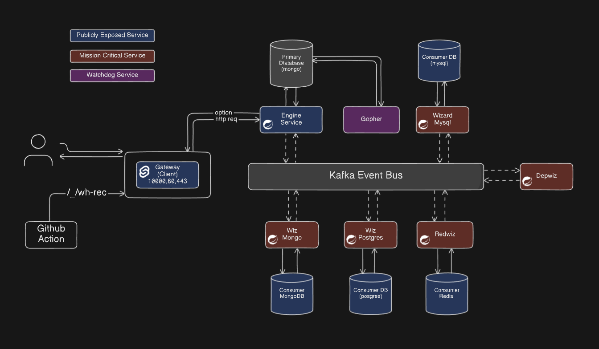

# freshcrafts

Self hosted application deployment platform. This is version 0.1 (alpha) and currently supports only nodejs based projects. 

## Features

1. Nodejs Application Deployment
    - Creation File Upload / Github Repo
    - Rollforward
    - Rollbacks [Issues]
    - Update and Re-deployments 
    - Domain [Incomplete]
2. Database and Database User Management
    - MySQL
    - Postgres
    - Mongo
    - Redis [Incomplete]
3. Uptime Monitoring
    - Monitors Dependency and Project Services
    - Monitors deployed project domains and ports
4. AI Stuff (Azure AI)
    - Chatbot 
    - Code Review & Documentation (Incomplete)
        - Code Review (Checks Vulnaribilities and Potential issues)
        - Code Documentation

## Who need this? There are so many other options. 

Well, this is just a prototype of our personal vercel like platform. User will have to spin a small vpc (like, 3core 4gb ram ) and install this thing, boom! User almost gets a vercel, a neondb, 

Yet,
- Students or Developers may deploy personal or side projects (the primary goal)
- Small software firms may deploy some small sites.
- Comparing with some current solution,
    - Vercel has coldstart for inactive websites and provides only one database on free tier. 
    - Heroku is not free anymore.
    - More will be added later.

The main issue of this project is that it does not scale automatically, mostly scales. Nginx does not allow this project to scale, thus, we have to plan to write a custom networking service to fix this issue.  

## Micro-services architecture 

## Installation and Setup

Follow [SETUP.md](SETUP.md)

## Contributions
Follow [CONTRIBUTING.md](CONTRIBUTING.md)

## Future Enhancements
- Webshell to access server from the cockpit
- Custom network service for scalling (using pingora maybe)
- Analytics for deployments/projects, databases and project itself. 
- Strategies for Vitess integration for mysql clustering, Clustering for mongodb, postgres
- Proper system health check + health check for all deployed projects.
- Deployment per branch like vercel.
- Adding Scylla DB (as, it's great)
- Code review per commit on github
- Custom docker container hub as docker hub allows only one private image
