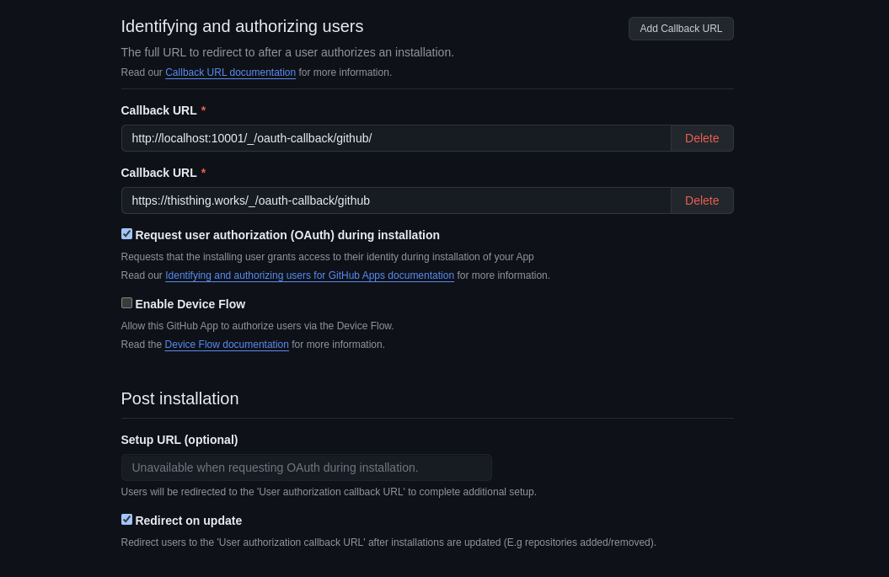
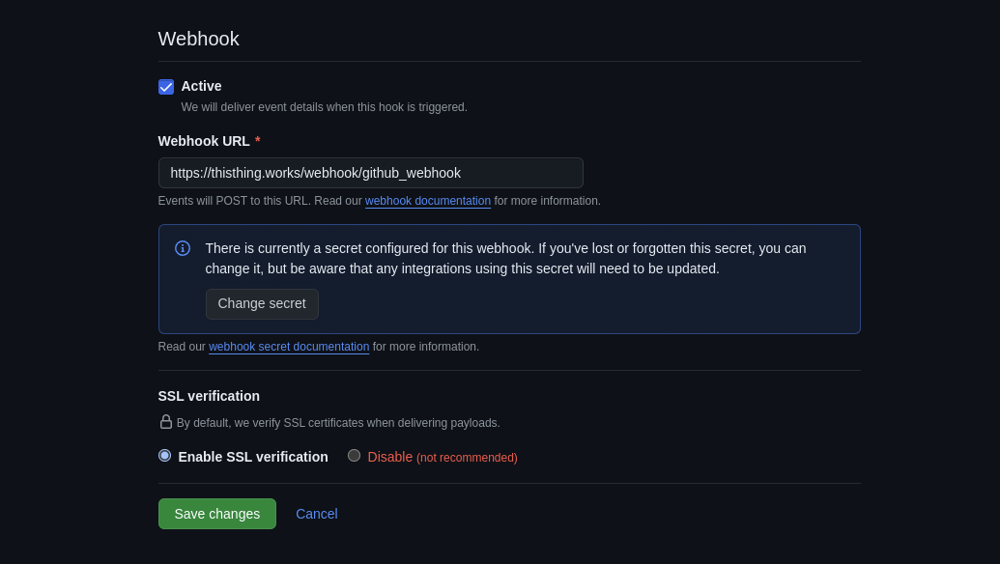

# SETUP Doc

Back to [README.md](README.md)


This project can be run locally or deployed to server. For both, primary setup part must be completed. Then, the app can be installed or run locally. 

- [Primary Setup](#primary-setup)
- [Development](#development)
- [Deployment](#deployment)


## Primary Setup

<details> 
<summary><strong>Step 0 Prerequisites and Downloads</strong></summary>

```sh
git clone https://github.com/shrestho0/freshcrafts.git
cd freshcrafts
```


System Prerequisites:

- [Docker Engine](!https://docs.docker.com/engine/install/)
- [Nodejs](!https://github.com/nodesource/distributions) (>= v22.06 recommended)
- [Python3 ](!https://www.python.org/downloads/) (>= v3.11.9)
- [Java 17 (or +)](!)
- [Golang](!https://go.dev/doc/install) (>= v1.23)

Note: for ubuntu 22.0 or later dependencies can be installed by running `cli/ubuntu-dep-installer.sh`. 
This is tested on 
This is not explicitly tested on other distros.


</details>

<details>
<summary><strong>Step 1: Copy `.env` file from `.env.example` && do your tweaks.</strong></summary>

```sh 
cp .env.example .env 
```
<details>
<summary>Setup Local Domain (to run locally)</summary>
If you want to test this locally and add a local domain to your system. 

For Linux/MacOS,

```
$ cat /etc/hosts                              

127.0.0.1       localhost
127.0.1.1       explorer

127.0.0.1       freshcrafts.local
127.0.0.1       test01.freshcrafts.local
127.0.0.1       test02.freshcrafts.local
127.0.0.1       test03.freshcrafts.local
...
```
</details>

<details>
<summary>How common .env file is used?</summary>


Each key:value pair is added to service specific env or application.properties files.
eg: `ENGINE_KEY=VALUE` goes to `engine/.../application.properties` as `KEY=VALUE`

</details>

</details>


<details>
<summary><strong>Step 2: Setup env to corresponding services</strong></summary>

```sh
cli/freshcrafts --setup-env
```

What it does and when should I run this command?

It creates required files consiting enviroment for each service, like .env for cockpit and gopher, application.properties for spring boot projects from root .env file You need to run this command every time .env file is changed.
 </details>

<details>
<summary><strong>Step 3: Setup Github App</strong></summary>

You can run it without using github app too. But, some features will not be used then. Thus, it's recommended

Create github app following these configurations from [here](https://github.com/settings/apps)

- Callback urls

 Note: Github currently does not support redirect_uri for their github app installation, rather send to first callback url. Again, that works fine with autorization url, which is being used on the login page. Because of for installing locally, keep your local callback url on the top of the list. [Check this issue.](https://github.com/orgs/community/discussions/64705)

<!-- cli/assets/gh_01.png -->


- Setup webhook url

<!--  -->


- Setup private keys. This will be used to communicate with github server from backend for getting informations, downloading files, and more. 

<!--  -->


Set to read-only, Actions, Administration, Checks,Code scanning alerts , Contents, Deployments(read/write), Metadata, Pull requests ,Repository security advisories , Secret scanning alerts 

Check events:
- Installation target 
- Meta
- Code scanning alert
- Deployment
- Pull Request
- Public
- Push
- Repository
- Release

</details>


## Development

Available Services: `cockpit`, `engine`, `wiz_mysql`,`wiz_mongo`,`wiz_postgres`, `depwiz`, `redwiz` 

Note: For convenience, it might be needed to install some specific services while other are being developed. 


<details>
<summary><strong>1. Start/Stop Dependency Services</strong></summary>

Dependency services: kafka, 2 mongo instances, mysql, postgres, redis

Dependency services are ran by docker.

To enable: `cli/freshcrafts --docker-up`

To disable: `cli/freshcrafts --docker-down`

</details>

<details>
<summary><strong>2. Install/Uninstall a service in dev mode</strong></summary>

Install: `cli/freshcrafts --install-dev wiz_mongo`. A

Install: `cli/freshcrafts --uninstall-dev wiz_mongo`. A

</details>

<details>
<summary><strong>3. Start dev </strong> </summary>

Run a service in dev: `cli/freshcrafts --start-dev cockpit`

(just use ctrl+c to stop)
</details>


Happy crafting!


## Deployment

WARNING: This project is under active development and currently in alpha phase (v0.1). Though, we deployed it, and it's working.

1. Install/Uninstall the application

Install: `cli/freshcrafts.py --install `

Update: `cli/freshcrafts.py --update `

2. Update the application

(update from github source is completed yet, manullary update files by running `git pull`)

Run: `python3 freshcrafts.py --update `

Need to run setup ssl explicitly for now.

