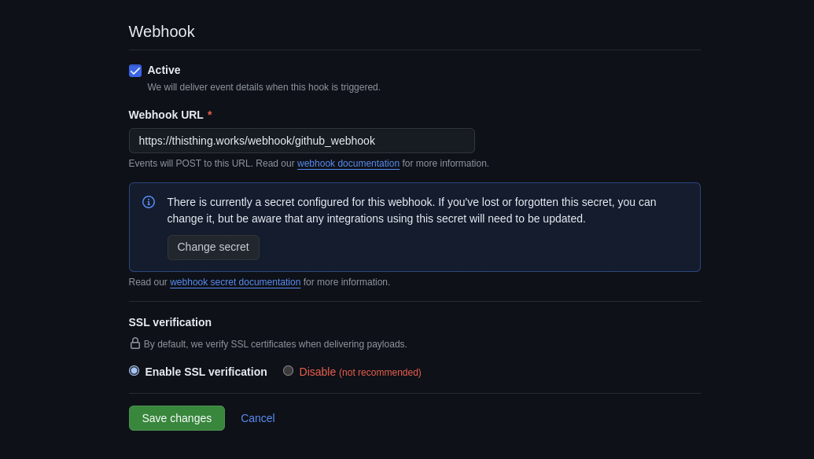
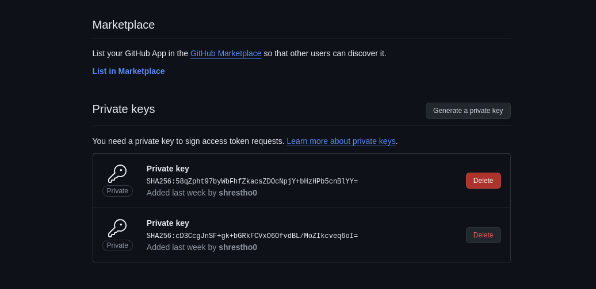

### Begin setup

- Copy `.env` file from `.env.example`
- `.env` and `setup-env.py` must be in the same directory
- [Checkout all envs](#environment-variables)

**How common .env file is used?**

Each key:value pair is added to service specific env or application.properties files.
eg: `ENGINE_KEY=VALUE` goes to `engine/.../application.properties` as `KEY=VALUE`

Run `python3 freshcrafts.py --setup-env` to setup service specific environments

### Deploy Deployment

#### Install 

Run: `python3 freshcrafts.py --install `

#### Update

(update from github source is completed yet, manullary update files by running `git pull`)

Run: `python3 freshcrafts.py --update `

#### Github App

Create github app following these configurations

- Callback urls

>> Note: Github currently does not support redirect_uri for their github app installation, rather send to first callback url. Again, that works fine with autorization url, which is being used on the login page. Because of for installing locally, keep your local callback url on the top of the list. [Check this issue.](https://github.com/orgs/community/discussions/64705)

- Setup webhook url

- Setup private keys. This will be used to communicate with github server from backend for getting informations, downloading files, and more. 

### Environment Variables

Details commented on .env/.env.example
